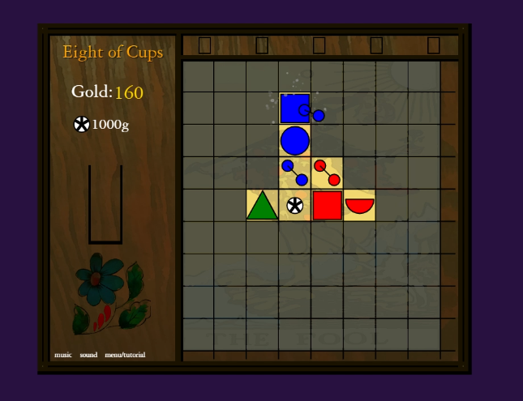

# Eight of Cups 
**by Joe Friedlander**

Pattern matching puzzle game inspired by Alchemy from PopCap Games

**Play online here:**  https://joefriedlander.github.io/eightofcups (Music and sound off by default, can be enabled)

### Screenshot:

### Info:
My first completed project.

Todo:
1. Refactor to use multiple files instead of one big one :slightly_smiling_face: Probably won't do as I'm not planning on updating it often
2. Colorblind support, and display credits as clickable and more readable html text rather than drawn on canvas
3. More items, levels, random events

### Attributions:

Tarot card images from Rider-Waite-Smith tarot deck and are edited

Tutorial theme: 'Curious Critters' by Matthew Pablo from
https://opengameart.org/content/curious-critters
under license https://creativecommons.org/licenses/by/3.0/
Song edited.

Main theme: 'It Is' by HorrorPen from
https://opengameart.org/content/it-is
under license https://creativecommons.org/licenses/by/3.0/
Song edited.

Line Complete Sound: 'Epic Amulet Item' by HorrorPen from
https://opengameart.org/content/epic-amulet-item
under license https://creativecommons.org/licenses/by/3.0/
Sound edited.

Special thanks to Fernando Barrientos for human factors advice